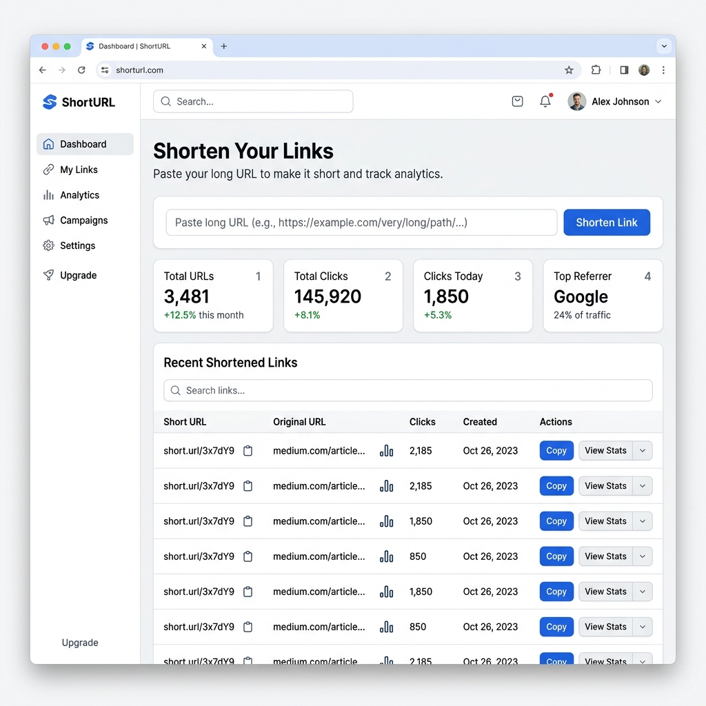

# URL Shortener Spring Boot React - Full Stack URL Shortening App



A full stack URL shortener application built with **Spring Boot 3**, **React**, **TypeScript**, **Vite**, **Tailwind CSS**, **Spring Data JPA**, and **H2 Database**. This project demonstrates how to build a modern Bitly-style short link platform with custom aliases, QR codes, click analytics, URL management, expiration dates, and a responsive dashboard.

This repository is useful for developers searching for a **Spring Boot URL shortener project**, **React URL shortener app**, **full stack Java project**, **URL shortener with analytics**, or **Java React portfolio project**.

## Highlights

- Shorten long URLs into clean shareable links
- Create custom aliases like `/my-link`
- Generate QR codes for every short URL
- Track clicks, browsers, operating systems, devices, referrers, and countries
- Search, filter, deactivate, and permanently delete shortened URLs
- Add optional password protection and expiration dates
- Use a Spring Boot REST API with a React TypeScript frontend
- Run locally with Maven and npm, or run the full stack with Docker Compose

## Demo Short Links

The backend includes seed data for local testing. These demo links are loaded from `backend/src/main/resources/data.sql` when the default in-memory H2 database starts.

| Short Link | Redirects To |
|-----------|--------------|
| `http://localhost:8080/google` | `https://www.google.com` |
| `http://localhost:8080/github` | `https://www.github.com` |
| `http://localhost:8080/stackoverflow` | `https://www.stackoverflow.com` |
| `http://localhost:8080/youtube` | `https://www.youtube.com` |
| `http://localhost:8080/linkedin` | `https://www.linkedin.com` |
| `http://localhost:8080/medium` | `https://www.medium.com` |
| `http://localhost:8080/twitter` | `https://www.twitter.com` |
| `http://localhost:8080/reddit` | `https://www.reddit.com` |
| `http://localhost:8080/wikipedia` | `https://www.wikipedia.org` |
| `http://localhost:8080/amazon` | `https://www.amazon.com` |

## Tech Stack

### Backend

| Technology | Purpose |
|-----------|---------|
| Spring Boot 3.2 | Java backend framework |
| Java 17+ | Backend runtime target |
| Spring Web | REST API and redirects |
| Spring Data JPA | Database persistence |
| H2 Database | Local development database |
| Bean Validation | Request validation |
| Lombok | Boilerplate reduction |
| ZXing | QR code generation |
| Maven Wrapper | Repeatable builds |

### Frontend

| Technology | Purpose |
|-----------|---------|
| React 19 | UI framework |
| TypeScript | Type-safe frontend code |
| Vite | Development server and build tool |
| Tailwind CSS | Styling |
| shadcn/ui | UI components |
| Recharts | Analytics charts |
| Lucide React | Icons |

## Features

### URL Shortening

- Create short URLs from long URLs
- Use generated short codes or custom aliases
- Copy short links to the clipboard
- Open short links in a new browser tab
- Store title and description metadata

### Analytics Dashboard

- View total URLs, active URLs, and total clicks
- Inspect per-link analytics
- Chart clicks over time
- Track browser, operating system, device, referrer, and country stats
- Store click events through the backend redirect flow

### Link Management

- List recently created URLs
- Search URLs by keyword
- Deactivate URLs without deleting analytics
- Permanently delete URLs and related click events
- Automatically clean up expired URLs with a scheduled task

### Backend Improvements

- Root API status endpoint: `GET /`
- Favicon-safe endpoint: `GET /favicon.ico`
- Proper `404` handling for missing static resources
- `spring.jpa.open-in-view=false` for cleaner persistence boundaries
- H2 dialect warning removed by letting Hibernate auto-detect the dialect

## Project Structure

```text
url-shortener-springboot/
|-- backend/
|   |-- mvnw
|   |-- mvnw.cmd
|   |-- pom.xml
|   |-- src/main/java/com/urlshortener/
|   |   |-- UrlShortenerApplication.java
|   |   |-- config/
|   |   |-- controller/
|   |   |-- dto/
|   |   |-- entity/
|   |   |-- repository/
|   |   `-- service/
|   `-- src/main/resources/
|       |-- application.properties
|       |-- application-dev.properties
|       `-- data.sql
|-- frontent/
|   |-- package.json
|   |-- vite.config.ts
|   `-- src/
|       |-- components/
|       |-- hooks/
|       |-- lib/
|       |-- pages/
|       |-- services/
|       `-- types/
|-- docker-compose.yml
|-- dashboard.png
`-- README.md
```

> Note: The frontend folder is currently named `frontent` in the repository.

## Quick Start

### Prerequisites

- Java 17 or newer
- Node.js 20 or newer
- npm
- Docker Desktop, optional

### 1. Clone the Repository

```bash
git clone https://github.com/imrajeevnayan/url-shortener-springboot.git
cd url-shortener-springboot
```

### 2. Start the Backend

```bash
cd backend
./mvnw spring-boot:run
```

On Windows PowerShell:

```powershell
cd backend
.\mvnw.cmd spring-boot:run
```

The backend runs at:

- API status: `http://localhost:8080/`
- REST API: `http://localhost:8080/api`
- H2 console: `http://localhost:8080/h2-console`

### 3. Start the Frontend

Open a second terminal:

```bash
cd frontent
npm install
npm run dev
```

The frontend runs at:

- `http://localhost:3000`

## Run with Docker Compose

If Docker is installed, run the full stack with:

```bash
docker-compose up --build
```

The application is served at:

- `http://localhost:80`

## API Endpoints

### URL Management

| Method | Endpoint | Description |
|--------|----------|-------------|
| `POST` | `/api/urls` | Create a short URL |
| `GET` | `/api/urls` | List active URLs with pagination |
| `GET` | `/api/urls/recent` | Get recently created URLs |
| `GET` | `/api/urls/{shortCode}` | Get URL details by short code |
| `GET` | `/api/urls/search?keyword=` | Search URLs |
| `PUT` | `/api/urls/{id}` | Update a URL |
| `DELETE` | `/api/urls/{id}` | Deactivate a URL |
| `DELETE` | `/api/urls/{id}/permanent` | Permanently delete a URL |
| `GET` | `/api/urls/{id}/analytics` | Get URL analytics |
| `GET` | `/api/urls/check/{shortCode}` | Check short code availability |

### Redirects and Status

| Method | Endpoint | Description |
|--------|----------|-------------|
| `GET` | `/` | Backend status response |
| `GET` | `/{shortCode}` | Redirect short URL to original URL |
| `GET` | `/favicon.ico` | Empty favicon response for browser requests |
| `GET` | `/api/redirect/{shortCode}/info` | Get redirect info without redirecting |

### Dashboard

| Method | Endpoint | Description |
|--------|----------|-------------|
| `GET` | `/api/dashboard/stats` | Get dashboard totals and recent URLs |

## Configuration

### Backend Configuration

Edit `backend/src/main/resources/application.properties`:

```properties
server.port=8080
spring.datasource.url=jdbc:h2:mem:urlshortenerdb
spring.datasource.username=sa
spring.datasource.password=
spring.jpa.hibernate.ddl-auto=create
spring.jpa.open-in-view=false
app.url-shortener.base-url=http://localhost:8080
app.url-shortener.default-expiry-days=30
```

For persistent local development, run with the `dev` profile:

```bash
./mvnw spring-boot:run -Dspring-boot.run.profiles=dev
```

### Frontend Configuration

The frontend API base URL can be set with `VITE_API_URL`:

```bash
VITE_API_URL=http://localhost:8080/api npm run dev
```

If no environment variable is set, the app falls back to `/api` or the value stored in browser local storage.

## H2 Database Console

Open:

```text
http://localhost:8080/h2-console
```

Default profile credentials:

```text
JDBC URL: jdbc:h2:mem:urlshortenerdb
Username: sa
Password:
```

Development profile credentials:

```text
JDBC URL: jdbc:h2:file:./data/urlshortener-dev
Username: sa
Password:
```

## Build and Verify

### Backend

```bash
cd backend
./mvnw test
./mvnw clean package
```

### Frontend

```bash
cd frontent
npm install
npm run build
```

## SEO Keywords

Spring Boot URL shortener, React URL shortener, Java URL shortener project, full stack URL shortener, URL shortener with analytics, custom short links, QR code URL shortener, Spring Boot React project, TypeScript URL shortener, H2 database Spring Boot project.

## Deployment

The React frontend builds into static files and can be deployed to Netlify, Vercel, GitHub Pages, or any static hosting provider.

The Spring Boot backend can be deployed as:

- Executable JAR on a Java server
- Docker container
- AWS Elastic Beanstalk
- Google Cloud Run
- Render, Railway, Fly.io, or similar platforms

For production, replace H2 with PostgreSQL or MySQL, configure a public `app.url-shortener.base-url`, disable demo seed data, and use environment variables for secrets.

## Repository

GitHub: [imrajeevnayan/url-shortener-springboot](https://github.com/imrajeevnayan/url-shortener-springboot)

## License

MIT License. You can use this URL shortener project for learning, portfolio work, interviews, or commercial experiments.
